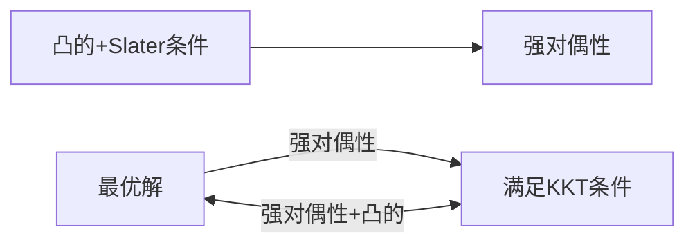

## 感知机

#### 核心思想

感知机的核心思想：在线性可分数据$D = \{(x_i, y_i) | y_i \in\{-1, 1\}\}$​​​中，使用一个超平面$\omega · x + b = 0$​​​​​将数据分开。其中线性可分的定义为：存在一超平面，使得$D$中任一数据点$(x_i, y_i)$都有
$$
y_i(\omega · x_i + b) > 0
$$
即$\omega · x_i + b$与$y_i$同号。

那么如何寻找这种超平面呢？我们需要一个损失函数，然后在每步的操作中降低这个损失函数的值。根据上式，我们自然地定义损失函数为
$$
Loss(D) = \sum_D Loss(x_i, y_i) \\
Loss(x_i, y_i) = \begin{cases}
	- y_i(\omega · x_i + b) & y_i(\omega · x_i + b) \le 0 \\
	0 & y_i(\omega · x_i + b) > 0 
\end{cases}
$$
不使用$0-1$损失函数是因为不方便求导；当该点被正确分类时，损失函数值为$0$​是因为我们只在乎正确分类，而不在乎正确分类的效果。

将上式稍变形，得到
$$
L(\omega, b) \equiv Loss(D) = - \sum_M y_i(\omega · x_i + b)
$$
其中$M$是误分类点的集合。

#### 如何优化

那么接下来就变成了一个优化问题：通过调整$\omega$​​和$b$​​，使$L(\omega, b)$​​​最小（为$0$​）。算法流程如下：

1）在迭代前，设置$\omega$和$b$的初始值为$0$，$M \leftarrow D$（初始化时对任意数据点，均有$y_i(\omega · x_i + b) \le 0$）。

2）从$M$中任取出点$(x_i, y_i)$，使用梯度下降，即每次迭代，参数值都向负梯度方向移动：
$$
\omega \leftarrow \omega - \eta \frac{\partial L}{\partial \omega} = \omega + \eta \sum_M y_ix_i \\
b \leftarrow b - \eta \frac{\partial L}{\partial b} = b + \eta \sum_M y_i
$$
其中$\eta$​被称作学习率，一般$0 \lt \eta \le 1$​​。

3）如果该点在迭代后被更新后的超平面正确分类，即$y_i(\omega · x_i + b) \ge 0$​​​，则将该点从$M$​​中移除，否则重复2）

4）直到$L(\omega, b)=0$（等价于$M=\emptyset$）

注：直接使用梯度下降有弊端：每更新一次参数，需要计算集合$M$​​中的所有点，耗费时间比较长。为了改良，我们这里使用随机梯度下降(STD)，每次只随机取出$M$​中的一个点$(x_i, y_i)$​更新参数：
$$
\omega \leftarrow \omega + \eta y_ix_i \\
b \leftarrow b + \eta y_i
$$
这样做会使参数每次收敛的时间更少（虽然需要收敛的次数几乎没有变），也在有些问题上更容易避免局部最小（当然，感知机只存在全局最小，没有局部最小）。

显然，这样的超平面有无穷多个，$M$中点迭代的顺序会影响最后得到的超平面参数。

#### 算法的收敛性

我们随后更关心的问题是：这个算法能否在有限步内完成迭代？如果能，迭代次数大概是多大的规模？$\text{Novihoff}$给出了一个关于迭代步数$k$的定理：
$$
k \le \left(\frac{R}{\gamma}\right)^2
$$
其中$R=\max \limits_{D} ||(x_i, y_i)||$​​​，$\gamma = \frac{\min \limits_{D} y_i(\omega_{opt} · x_i + b_{opt})}{||(\omega_{opt}, b_{opt})||}$​​​，$\omega_{opt}, b_{opt}$​​​是将数据集完全分开时的超平面参数。

证明：

不妨假设$\omega_0 = b_0 = 0$。为了后续表示方便，记$\omega^{+}=(\omega, b), x_i^{+}=(x_i, 1)$​​，在第$k$次迭代时有
$$
\omega_k^{+} = \omega_{k-1}^{+} + \eta y_kx_k^{+}
$$
其中$(x_k, y_k)$是此时$M$​中仅存的元素。

在上式两端同乘$\omega_{opt}^{+}$，得到：
$$
\omega_k^{+} · \omega_{opt}^{+} = \omega_{k-1}^{+} · \omega_{opt}^{+} + \eta y_k(x_k^{+} · \omega_{opt}^{+})
$$
由于$\omega_{opt}^{+} · x = 0$是最优超平面，依线性可分的定义，有$y_k(x_k^{+} · \omega_{opt}^{+}) \ge \min \limits_{D} y_i(\omega_{opt} · x_i + b_{opt}) = \gamma · ||\omega_{opt}^{+}||$ 。

递推可知
$$
\omega_k^{+} · \omega_{opt}^{+} \ge \omega_{0}^{+} · \omega_{opt}^{+} + k\gamma ·||\omega_{opt}^{+}|| = k\gamma ·||\omega_{opt}^{+}||
$$
而根据$\text{Cauthy-Schwatz}$不等式，我们知道
$$
\omega_k^{+} · \omega_{opt}^{+} \le ||\omega_k^{+}|| · ||\omega_{opt}^{+}||
$$
与上式联立观察，即
$$
k \gamma \le ||\omega_k^{+}||
$$
自然地，我们希望能用$k$，$\gamma$和$R$表示出$||\omega_k^{+}||$的上界，这指引我们构造$\omega_k^{+}$的内积形式：
$$
\begin{aligned}
||\omega_k^{+}||^2 &= \omega_k^{+} · \omega_k^{+} = (\omega_{k-1}^{+} + \eta y_kx_k^{+}) · (\omega_{k-1}^{+} + \eta y_kx_k^{+}) \\
&= ||\omega_{k-1}^{+}||^2 + \eta^2 y_k^2 ||x_{k}^{+}||^2 + 2 \eta y_k(x_{k}^{+} · \omega_{k-1}^{+})
\end{aligned}
$$
易知$y_k^{2}=1$，而$(x_k, y_k)$是超平面$\omega_{k-1}^{+} · x = 0$误分类的点（否则也不需要使用该点迭代了），则有$y_k(x_{k}^{+} · \omega_{k-1}^{+}) \le 0$，代入化简：
$$
||\omega_k^{+}||^2 \le ||\omega_{k-1}^{+}||^2 + \eta^2 ||x_{k}^{+}||^2 \le ||\omega_{0}^{+}||^2 + k\eta^2 ||x_{k}^{+}||^2 = k\eta^2 ||x_{k}^{+}||^2 \le k\eta^2 R^2
$$
代入上文，即
$$
k \gamma \le \sqrt{k\eta^2 R^2}
$$
化简即得
$$
k \le \left(\frac{R}{\gamma}\right)^2
$$
于是我们知道，在有限步内，一定能取得最优的超平面。其中数据点的模长最大值越大，与最优超平面的距离越小，迭代次数的上界越大。

#### 对偶算法

从算法流程中我们发现，$\omega$​和$b$​是大小分别为$n$​和$1$​的两个向量，实际上分别是$y_ix_i$​和$y_i$​的线性组合，且由于两个参数是同步更新的，所以两个组合的权重也相同。于是，我们可以仅采用一个大小为数据集大小$N$​的权重向量$\alpha=(\alpha_1, \alpha_2, ..., \alpha_N)$​来代替$\omega$​和$b$​两个参数，得到$\alpha$​后，$\omega$​和$b$​可以自然得出：
$$
\omega_{opt} = \sum_{i=1}^{N} \alpha_i y_i x_i, \quad b_{opt} = \sum_{i=1}^{N} \alpha_i y_i
$$
于是我们得到了一款新的算法来实现感知机。由于此算法的参数大小为$N$，原算法参数的大小为$n$，正好是数据集的两个维度，所以称此算法是原算法的对偶算法，流程如下：

1）在迭代前，设置$\alpha$的初始值为$0$，$M \leftarrow D$（初始化时所有数据点均未被正确分类）。

2）从$M$中任取出点$(x_i, y_i)$。当点$(x_i, y_i)$在迭代时，其权重$\alpha_i$做如下更新：
$$
\alpha_i \leftarrow \alpha_i + \eta
$$
3）如果该点在迭代后被更新后的超平面正确分类，即$y_i(\omega · x_i + b) = y_i \left(\sum \limits_{j=1}^{N} \alpha_j y_j (x_j · x_i + 1) \right) \ge 0$，则将该点从$M$中移除，否则重复2）

4）直到$L(\omega, b)=0$（等价于$M=\emptyset$）

注意到对偶算法中很多次地用到内积运算，我们可以提前计算好$D$中两两数据点之间的内积，即$Gram$​矩阵：
$$
Gram(D) = [x_i · x_j]_{N \times N}
$$
来降低算法的时间复杂度。

#### 原算法与对偶算法的比较

最后，让我们来比较原算法和对偶算法：

原算法需要$k$次迭代，每次迭代$\omega$与判断是否正确分类时各需要一次时间复杂度为$n$（其中$n$是数据的维数）的向量乘法。总的时间复杂度为$2kn = \Theta(kn)$​；

对偶算法也需要$k$次迭代，但每次迭代$\alpha_i$和判断是否正确的时间复杂度分别是$\Theta(1)$和$\Theta(N)$，建$Gram$矩阵的时间复杂度为$N(N-1)/2$，总的时间复杂度为$N(N-1)/2 + kN = \Theta(N^2+kN)$​

一般情况下，$k=cN$​​（$c$​​为$\gt 1$的常数）。于是原算法的时间复杂度为$\Theta(Nn)$，对偶算法的时间复杂度为$\Theta(N^2)$。当$n \gg N$​​​时，对偶算法将在时间复杂度上更占优势。

## 线性可分支持向量机

#### 优化问题的提出

由上文，我们得到了一个超平面，它可以将线性可分数据$D = \{(x_i, y_i) | y_i \in\{-1, 1\}\}$分开，且这种超平面有无穷多个。我们希望在这些超平面中，以某种指标选择唯一最好的超平面。为了能用于新数据的预测，我们自然地认为，超平面与$D$中所有数据点的距离最小值越大越好，说明数据点被分得足够“开”。于是，我们得到了优化的目标，即
$$
\max_{\omega, b} \min_{D} \frac{|\omega · x_i + b|}{||\omega||}
$$
此外，我们还要保证该超平面能将数据集分开，所以要加上感知机的限制条件：
$$
\quad y_i(\omega · x_i + b) \ge \gamma > 0, \quad i=1, 2, ..., N
$$
其中$\gamma = \min \limits_D y_i(\omega · x_i + b)$。

注意到$ \min \limits_D \frac{|\omega · x_i + b|}{||\omega||} = \frac{\min \limits_D y_i(\omega · x_i + b)}{||\omega||} = \frac{\gamma}{||\omega||}$。于是我们得到了完整的最优化问题：
$$
\begin{aligned}
\max_{\omega, b} &\quad \frac{\gamma}{||\omega||} \\
s.t. &\quad y_i(\omega · x_i + b) \ge \gamma, \quad i=1, 2, ..., N
\end{aligned}
$$
然而，这个最优化函数难以对参数求导，我们计划对该问题进行简化：

注意到，该问题有无穷多个最优解，对应一个相同的超平面。如果$(\omega, b)$是上述问题的最优解之一，那么对$\forall k \ne 0$，$(k\omega, kb)$都是上述问题的最优解，且$\gamma$同时增大$k$倍，所以$\gamma$的值其实并不重要。于是我们可以直接令$\gamma=1$，从而将该问题简化为（因子$2$是为了对应下文谈到的几何意义）
$$
\begin{aligned}
\max_{\omega, b} &\quad \frac{2}{||\omega||} \\
s.t. &\quad y_i(\omega · x_i + b) \ge 1, \quad i=1, 2, ..., N
\end{aligned}
$$
简化后问题的最优解将是$\left(\frac{\omega}{\gamma}, \frac{b}{\gamma}\right)$，与原问题的解$(\omega, b)$指代相同的超平面。

进一步注意到，$\max \limits_D \frac{2}{||\omega||}$等效于$\min \limits_D \frac{1}{2}||\omega||^2$（因子$\frac{1}{2}$是为了后续求导方便），于是最终我们得到了所需要的优化问题：
$$
\begin{aligned}
\min_{\omega, b} &\quad \frac{1}{2}||\omega||^2 \\
s.t. &\quad 1 - y_i(\omega · x_i + b) \le 0, \quad i=1, 2, ..., N
\end{aligned}
$$
且简化后的问题的解存在且唯一。

#### 最优超平面存在且唯一

1）存在性

由于数据集是线性可分的，所以一定存在可行解，取可行解中$||\omega||^2$的最小值即可。

2）唯一性

假设存在两组不同最优解$(\omega_1, b_1), (\omega_2, b_2)$，使得$||\omega_1|| = ||\omega_2|| = \min \limits_{\omega, b} ||\omega||$。令$\omega_0 = \frac{\omega_1 + \omega_2}{2}, b_0 = \frac{b_1 + b_2}{2}$，由于两组最优解均满足约束条件，两式相加，有
$$
y_i(\omega_0 · x_i + b_0) \ge 1, \quad i=1, 2, ..., N
$$
于是$(\omega_0, b_0)$是问题的可行解。则有
$$
||\omega_0|| \ge ||\omega_1|| = ||\omega_2|| \\
||\omega_0|| \le \frac{||\omega_1|| + ||\omega_2||}{2}
$$
即
$$
||\frac{\omega_1 + \omega_2}{2}|| = ||\omega_1|| = ||\omega_2||
$$
解得，$\omega_1 = \lambda \omega_2, \lambda = \pm 1$。若$\lambda = -1$，则$\omega_0 = 0$，对应一个斜率为$0$的超平面。由于$D$中必然同时存在$y=+1$和$y=-1$的两类点，所以该平面必然不能将其分开，也就是说$(\omega_0, b_0)$不是问题的可行解，矛盾。所以必然有$\lambda = 1$，即$\omega_1 = \omega_2$，记为$\omega$。

另外，注意到此问题的约束条件中，在最优解下，正类点和负类点中必各有一点$(x_1, 1)$和$(x_2, -1)$使得等号成立，否则会有更优的解使得$||\omega||$更小（即点距离直线的最小值更大，可以通过画图直观感受）。取在最优解$(\omega, b_1), (\omega, b_2)$下使约束条件取等的点分别为$(x_{11}, 1), (x_{12}, -1), (x_{21}, 1), (x_{22}, -1)$，有
$$
\begin{aligned}
\omega · x_{11} + b_2 \ge 1 &= \omega · x_{11} + b_1 \\
\omega · x_{21} + b_1 \ge 1 &= \omega · x_{21} + b_2
\end{aligned}
$$
于是我们得到$b_1 = b_2$，即$(\omega_1, b_1) = (\omega_2, b_2)$，两组解相同。

#### 几何意义

使约束条件取等的数据点在两个超平面$\omega · x + b = 1(y_i=+1)$或$\omega · x + b = -1(y_i=-1)$上，使约束条件取小于号的数据点在两个超平面的外侧。最优化的目标$\frac{2}{||\omega||}$代表着两个超平面的间距。

注意到，只有在两个超平面上的少数数据点决定了间距的大小（在两个超平面之外的点对优化问题没有实际作用），因此这些点所对应的向量也被称作支持向量，这也是“支持向量机”这一名称的由来。

另外，由于两个超平面内没有点存在，这一要求是“绝对”的，所以也称此时的间距为“硬间隔”（对应地，在非线性可分的支持向量机中还会提到“软间隔”）。

#### $\text{Lagrange}$法简介

接下来我们考虑如何求解。这是一个典型的凸二次规划问题，我们将采用$\text{Lagrange}$法求解该问题。首先简单介绍$\text{Lagrange}$法：

考虑如下带约束的最优化问题：
$$
\begin{aligned}
\min_{x} \quad &f(x) \\
s.t. \quad &c_i(x) \le 0, \quad i=1, 2, ..., k \\
\quad &h_j(x) = 0, \quad j=1, 2, ..., l
\end{aligned}
$$
其中$x \in \mathbb{R}^n$，$c_i(x)$与$h_i(x)$都是连续可微的。

引入广义$\text{Lagrange}$函数：
$$
L(x, \alpha, \beta) = f(x) + \sum_{i=1}^{k} \alpha_i c_i(x) + \sum_{j=1}^{l} \beta_j h_j(x)
$$
其中$\alpha$和$\beta$是$\text{Lagrange}$乘子，$\alpha_i \ge 0$。

令$\theta_P(x) = \max \limits_{\alpha, \beta} L(x, \alpha, \beta)$，显然
$$
\theta_P(x) = \begin{cases}
f(x) & c_i(x) \le 0, h_i(x) \ne 0 \\
+\infty & otherwise
\end{cases}
$$
于是，我们可以使用无约束的最优化问题（记为极小极大问题）
$$
\min \limits_{x} \max \limits_{\alpha, \beta} L(x, \alpha, \beta)
$$
作为有约束的优化问题
$$
\begin{aligned}
\min_{x} \quad &f(x) \\
s.t. \quad &c_i(x) \le 0, \quad i=1, 2, ..., k \\
\quad &h_j(x) = 0, \quad j=1, 2, ..., l
\end{aligned}
$$
的替代。

自然地，我们在极小极大问题（原问题）的基础上，考虑其对偶问题，即极大极小问题：
$$
\max \limits_{\alpha, \beta} \min \limits_{x} L(x, \alpha, \beta)
$$
对应地，记$\min \limits_{x} L(x, \alpha, \beta)$为$\theta_D(x)$。

由于
$$
\theta_D(x) \le L(x, \alpha, \beta) \le \theta_P(x), \quad \forall x \in \mathbb{R}^n
$$
于是我们可以知道极小极大问题与极大极小问题的关系：
$$
\max \limits_{\alpha, \beta} \theta_D(x) \le \min \limits_{x} \theta_P(x)
$$
即
$$
\max \limits_{\alpha, \beta} \min \limits_{x} L(x, \alpha, \beta) \le \min \limits_{x} \max \limits_{\alpha, \beta} L(x, \alpha, \beta)
$$
记$\max \limits_{\alpha, \beta} \min \limits_{x} L(x, \alpha, \beta) = d^*, \min \limits_{x} \max \limits_{\alpha, \beta} L(x, \alpha, \beta) = p^*$。由于对偶问题往往比原问题好解，所以我们希望可以通过求解对偶问题来求解原问题，最好两个问题的解也有联系。这里不加证明地给出两个定理：

**定理一：如果$f(x)$和$c_i(x)$都是凸函数且$h_j(x)$是仿射函数且满足$\text{Slater}$条件，则$d^{*} = p^{*}$，此时称为原问题具有强对偶性。**

其中$\text{Slater}$条件为：

$\exists x \in \mathbb{R}^n$，使得$c_i(x) < 0, \forall i$（不等号能在部分定义域上对所有约束条件严格取到）。

注：仿射函数是指类似$h_j(x)=Ax + b$的函数。

其中，仿射函数指形如$h_j(x)=Ax+b$的函数。

**定理二：对于具有强对偶性的问题，其最优解$x$和对偶问题的最优解$\alpha, \beta$必然满足$\text{Karush-Kuhn-Tucker(KKT)}$条件；如果该问题还同时满足：$f(x)$和$c_i(x)$都是凸函数且$h_j(x)$是仿射函数，则满足$\text{KKT}$条件的数据$x, \alpha, \beta$也一定分别是原问题和对偶问题的最优解。**

其中$\text{KKT}$条件为：
$$
\frac{\partial L}{\partial x} = 0	\quad (1) \\
\alpha_i c_i(x) = 0 \quad (2) \\
c_i(x) \le 0, h_i(x) = 0 \quad (3) \\
\alpha_i \ge 0 \quad (4)
$$
其中$(1)$被称为稳定性条件（stationarity），$(2)$被称为对偶松弛条件（complementary slackness），$(3)$被称为原问题可行性条件（primal feasibility），$(4)$被称为对偶问题可行性条件（dual feasibility）。

约定：如果$f(x)$和$c_i(x)$都是凸函数且$h_j(x)$是仿射函数，则称该问题是凸的。基于此，两个定理的联系逻辑图如下：

这两个定理告诉我们，如果满足一定的条件，原问题和对偶问题的最优值将相同，二者的解也有联系。

#### 用$\text{Lagrange}$法求解问题（得到对偶问题）

我们将用$\text{Lagrange}$方法解上文的优化问题，首先写出广义$\text{Lagrange}$函数：
$$
L(\omega, b, \alpha) = \frac{1}{2}||\omega||^2 + \sum \limits_{i=1}^{N} \alpha_i \left(1 - y_i(\omega · x_i + b) \right)
$$
其中$\alpha_i \ge 0$。

我们根据上文可知，原本的有限制优化问题
$$
\begin{aligned}
\min_{\omega, b} &\quad \frac{1}{2}||\omega||^2 \\
s.t. &\quad 1 - y_i(\omega · x_i + b) \le 0, \quad i=1, 2, ..., N
\end{aligned}
$$
将等价于极小极大问题：
$$
\min \limits_{\omega, b} \max \limits_{\alpha} L(\omega, b, \alpha)
$$
与$\text{Lagrange}$法的一般情况对比，$f(\omega, b)=\frac{1}{2}||\omega||^2$和$c_i(\omega, b) = 1 - y_i(\omega · x_i + b)$都是凸函数，且此时$h_j(\omega, b) \equiv 0$是仿射函数，所以该问题是凸的；接下来，我们关注$\text{Slater}$条件是否成立：即证明$\exists (\omega, b)$，使得对于$\forall i$，都有$c_i(\omega, b) < 0$。

考虑任一能将数据集$D$线性分开的超平面参数$(\omega_0, b_0)$，考虑线性可分的定义，即对数据集的每个点$(x_i, y_i)$，都有
$$
y_i(\omega_0 · x_i + b_0) > 0
$$
记$\gamma_0 = \min \limits_{D} y_i(\omega_0 · x_i + b_0)$，取$(\omega_0^{'}, b_0^{'}) = \left(\frac{2 \omega_0}{\gamma_0}, \frac{2 b_0}{\gamma_0}\right)$，则有
$$
1 - y_i(\omega_0^{'} · x_i + b_0^{'}) \le -1 < 0, \quad \forall i
$$
于是$\text{Slater}$条件成立，问题是强对偶的。所以我们只需要解出对偶问题，就能根据$\text{KKT}$条件得到原问题的解，且两个解的最优值相同。对偶问题是
$$
\max \limits_{\alpha} \min \limits_{\omega, b} L(\omega, b, \alpha)
$$
首先我们需要计算$\min \limits_{\omega, b} L(\omega, b, \alpha)$，这只需令导数为$0$，即
$$
\frac{\partial L}{\partial \omega} = \omega - \sum \limits_{i=1}^{N} \alpha_i y_i x_i = 0 \\
\frac{\partial L}{\partial b} = - \sum \limits_{i=1}^{N} \alpha_i y_i = 0
$$
代入化简后的广义$\text{Lagrange}$函数：
$$
L(\omega, b, \alpha) = \frac{1}{2}\omega^2 + \sum \limits_{i=1}^{N} \alpha_i - \left(\sum \limits_{i=1}^{N} \alpha_i y_i · x_i \right)\omega - \left(\sum \limits_{i=1}^{N} \alpha_i y_i \right) b
$$
得到：
$$
\min \limits_{\omega, b} L(\omega, b, \alpha) = \sum \limits_{i=1}^{N} \alpha_i - \frac{1}{2} \sum \limits_{i, j}^{N} \alpha_i \alpha_j y_i y_j (x_i · x_j)
$$
即对偶问题为：
$$
\begin{aligned}
\max_{\alpha}  \quad& \sum \limits_{i=1}^{N} \alpha_i - \frac{1}{2} \sum \limits_{i, j}^{N} \alpha_i \alpha_j y_i y_j (x_i · x_j) \\
s.t. \quad& \alpha_i \ge 0, \quad i=1, 2, ..., N \\
\quad& \sum \limits_{i=1}^{N} \alpha_i y_i = 0
\end{aligned}
$$
提出式子中的负号，变为
$$
\begin{aligned}
\min_{\alpha}  \quad& \frac{1}{2} \sum \limits_{i, j}^{N} \alpha_i \alpha_j y_i y_j (x_i · x_j) - \sum \limits_{i=1}^{N} \alpha_i \\
s.t. \quad& \alpha_i \ge 0, \quad i=1, 2, ..., N \\
\quad& \sum \limits_{i=1}^{N} \alpha_i y_i = 0
\end{aligned}
$$
这个问题我们在求解线性不可分的支持向量机时再解。

#### 对偶问题与原问题解的关系

先假设我们解得了对偶问题的最优解$\alpha^{*}$，我们可以根据$\text{KKT}$条件：
$$
\begin{cases}
\frac{\partial L}{\partial \omega} = \omega - \sum \limits_{i=1}^{N} \alpha_i y_i x_i = 0, \quad
\frac{\partial L}{\partial b} = - \sum \limits_{i=1}^{N} \alpha_i y_i = 0 \\
\alpha_i \left(1 - y_i(\omega · x_i + b) \right) = 0 \\
1 - y_i(\omega · x_i + b) \le 0 \\
\alpha_i \ge 0
\end{cases}
$$
解出原问题的解$(\omega^{*}, b^{*})$。首先易得到$\omega^{*}=\sum \limits_{i=1}^{N} \alpha_i^{*} y_i x_i$。其次，由上文可知，$\omega^{*} \ne 0$，所以$\alpha_i^{*}$不能全为$0$。选择任一$\alpha_j^{*} \ne 0$，则$1 - y_j(\omega^{*} · x_j + b^{*}) = 0$。在两端同乘$y_j$，即$y_j - y_j^2(\omega^{*} · x_j + b^{*}) = 0$。考虑$y_j^2 = 1$，化简得到
$$
\begin{aligned}
\omega^{*} &= \sum \limits_{i=1}^{N} \alpha_i^{*} y_i x_i \\
b^{*} &= y_j - \sum \limits_{i=1}^{N} \alpha_i^{*} y_i (x_i · x_j)
\end{aligned}
$$
将约束$\alpha_i \left(1 - y_i(\omega · x_i + b) \right) = 0$两端求和：
$$
\begin{aligned}
\sum \limits_{i=1}^{N} \alpha_i^{*} \left(1 - y_i(\omega^{*} · x_i + b^{*}) \right) &= \sum \limits_{i=1}^{N} \alpha_i^{*} - \left( \sum \limits_{i=1}^{N} \alpha_i^{*} y_i x_i \right) \omega^{*} - \left( \sum \limits_{i=1}^{N} \alpha_i^{*} y_i \right) b^{*} \\
&= \sum \limits_{i=1}^{N} \alpha_i^{*} - ||\omega^{*}||^2 \\
&= 0
\end{aligned}
$$
据此，我们可以用对偶问题的解表示原问题的最优值，即最小间隔：
$$
\frac{2}{||\omega^{*}||} = \frac{2}{\sqrt{\sum \limits_{i=1}^{N} \alpha_i^{*}}}
$$
从$\omega^{*}, b^{*}$的表达式可以看出，只有$\alpha_i^{*} > 0$的点对参数起作用，这些向量也就是我们上文提到的“支持向量”。由前文可知，当$\alpha_i \ne 0$时，有$y_i(\omega^{*} · x_j + b^{*}) = 1$，这说明这些点恰好在两个超平面$\omega^{*} · x + b^{*} = 1(y_i=+1)$或$\omega^{*} · x^{*} + b = -1(y_i=-1)$上。

## 线性不可分（线性）支持向量机

#### 引入松弛因子

首先明确：题目的第一个“线性”表示这里讨论的是数据集$D$不满足线性可分条件的情形；第二个“线性”表示我们的分类器依然是一个超平面，而非曲面。

对于某些非线性可分的数据集$D$，即
$$
\forall \omega, b, \quad \exists x_i, y_i, \quad s.t. \quad y_i(\omega · x_i + b) < 0
$$
于是我们需要给误分类的点$(x_i, y_i)$加上一个松弛因子$\xi_i \ge 0$，就能保证$\exists \omega, b$，使得
$$
y_i(\omega · x_i + b) + \xi_i \ge 1, \quad \forall x_i, y_i
$$
当然，我们希望松弛因子不要加太多，所以我们要在原优化目标上加上松弛因子的和，再乘上常数因子作为惩罚项，即原优化问题将变为；
$$
\begin{aligned}
\min_{\omega, b} &\quad \frac{1}{2}||\omega||^2 + C \sum \limits_{i=1}^{N} \xi_i \\
s.t. &\quad 1 - y_i(\omega · x_i + b) - \xi_i \le 0, \quad i=1, 2, ..., N \\
&\quad - \xi_i \le 0, \quad i=1, 2, ..., N \\
\end{aligned}
$$
其中超参数$C \ge 0$，一般通过在验证集上的表现确定。$C$值越小，对松弛因子的惩罚越小，视觉上超平面的分类效果越差。

当然，“松弛因子的和“这一惩罚表述不是绝对的，我们有时也可以选用$\xi_i$的$p$次幂之和作为惩罚项，即：
$$
\begin{aligned}
\min_{\omega, b} &\quad \frac{1}{2}||\omega||^2 + C \sum \limits_{i=1}^{N} \xi_i^p \\
s.t. &\quad 1 - y_i(\omega · x_i + b) - \xi_i \le 0, \quad i=1, 2, ..., N \\
&\quad - \xi_i \le 0, \quad i=1, 2, ..., N \\
\end{aligned}
$$
其中超参数$p \ge 0$，也可以通过在验证集上的表现确定。

#### 原问题与结构风险最小化的联系

通过观察原问题，我们可以注意到，对于最优解$(\omega^{*}, b^{*})$，如果$\xi_i^{*} < \max \left( 1 - y_i(\omega^{*} · x_i + b^{*}), 0 \right)$，则满足不了约束；如果$\xi_i^{*} > \max \left( 1 - y_i(\omega^{*} · x_i + b^{*}), 0 \right)$，则不能保证$\sum \limits_{i=1}^{N} \xi_i$最小。因此$\xi_i$的最优解$\xi_i^{*}$必为$\max \left( 1 - y_i(\omega^{*} · x_i + b^{*}), 0 \right)$。所以我们不妨直接令$\xi_i = \max \left( 1 - y_i(\omega · x_i + b), 0 \right)$，代入原优化问题可以得到等价的无限制优化问题：
$$
\min_{\omega, b} \quad \frac{1}{2}||\omega||^2 + C \sum \limits_{i=1}^{N} \max \left( 1 - y_i(\omega · x_i + b), 0 \right)
$$
令$h(x) = \max(1-x, 0)$，则等价于
$$
\min_{\omega, b} \quad  \sum \limits_{i=1}^{N} h\left( y_i(\omega · x_i + b) \right) + C' ||\omega||^2
$$
我们可以看出，原问题等价于损失函数为$h(x)$时的结构风险最小化问题。其中由于$h(x)$的图像长得像门上的合页，所以称$h(x)$为合页函数。

对应地，可以发现，如果我们不使用松弛因子的和作为惩罚项，而用“使用松弛因子的数据点的数目”作为惩罚项，即：
$$
\begin{aligned}
\min_{\omega, b} &\quad \frac{1}{2}||\omega||^2 + C \sum \limits_{i=1}^{N} \mathbb{I}(\xi_i \ne 0) \\
s.t. &\quad 1 - y_i(\omega · x_i + b) - \xi_i \le 0, \quad i=1, 2, ..., N \\
&\quad - \xi_i \le 0, \quad i=1, 2, ..., N \\
\end{aligned}
$$
该问题将等价于损失函数为$0-1$函数时的结构风险最小化问题，即：
$$
\min_{\omega, b} \quad  \sum \limits_{i=1}^{N} g\left( y_i(\omega · x_i + b) \right) + C' ||\omega||^2
$$
其中
$$
g(x) = \begin{cases}
1 & x > 0 \\
0 & x \le 0
\end{cases}
$$

#### 最优超平面的存在性（唯一性见下文）

这里先只证明最优超平面一定存在。对$\forall \omega, b$，只需取$\xi_i = 1 - y_i(\omega · x_i + b)$，再从中选取使$\frac{1}{2}||\omega||^2 + C \sum \limits_{i=1}^{N} \xi_i$最小的$(\omega, b, \xi)$作为最优解即可。

#### 对偶问题的形式

为了求解原问题，我们仍然采用$\text{Lagrange}$方法。首先写出广义$\text{Lagrange}$函数：
$$
L(\omega, b, \xi, \alpha, \beta) = \frac{1}{2}||\omega||^2 + C \sum \limits_{i=1}^{N} \xi_i + \sum \limits_{i=1}^{N} \alpha_i \left(1 - y_i(\omega · x_i + b) - \xi_i \right) - \sum \limits_{i=1}^{N} \beta_i \xi_i
$$
其中$\alpha_i \ge 0, \beta_i \ge 0$。

与线性情况类似地，原问题等价于$\text{Lagrange}$函数的极小极大问题：
$$
\min \limits_{\omega, b, \xi} \max \limits_{\alpha, \beta} L(\omega, b, \xi, \alpha, \beta)
$$
与线性情况类似，可以判定该问题是凸的。任取$(\omega_0, b_0)$，取$\xi_i = \max(2 - \min \limits_{D} y_i(\omega_0 · x_i + b_0), 1)$，则有
$$
\begin{aligned}
1 - y_i(\omega · x_i + b) - \xi_i &\le -1 < 0, \quad i=1, 2, ..., N \\
- \xi_i &\le -1 < 0, \quad i=1, 2, ..., N \\
\end{aligned}
$$
即不等式是严格可行的，满足$\text{Slater}$条件，所以问题是强对偶的。

于是我们只需要考虑对偶问题$\max \limits_{\alpha, \beta} \min \limits_{\omega, b, \xi} L(\omega, b, \xi, \alpha, \beta)$，先求$\min \limits_{\omega, b, \xi} L(\omega, b, \xi, \alpha, \beta)$，令导数为$0$：
$$
\frac{\partial L}{\partial \omega} = \omega - \sum \limits_{i=1}^{N} \alpha_i y_i x_i = 0 \\
\frac{\partial L}{\partial b} = - \sum \limits_{i=1}^{N} \alpha_i y_i = 0 \\
\frac{\partial L}{\partial \xi_i} = C - \alpha_i - \beta_i= 0
$$
代入化简后的广义$\text{Lagrange}$函数：
$$
L(\omega, b, \xi, \alpha, \beta) = \frac{1}{2}\omega^2 + \sum \limits_{i=1}^{N} \alpha_i + \sum \limits_{i=1}^{N} (C-\alpha_i - \beta_i)\xi_i - \left(\sum \limits_{i=1}^{N} \alpha_i y_i · x_i \right)\omega - \left(\sum \limits_{i=1}^{N} \alpha_i y_i \right) b
$$
得到：
$$
\min \limits_{\omega, b} L(\omega, b, \xi, \alpha, \beta) = \sum \limits_{i=1}^{N} \alpha_i - \frac{1}{2} \sum \limits_{i, j}^{N} \alpha_i \alpha_j y_i y_j (x_i · x_j)
$$
即对偶问题为：
$$
\begin{aligned}
\max_{\alpha}  \quad& \sum \limits_{i=1}^{N} \alpha_i - \frac{1}{2} \sum \limits_{i, j}^{N} \alpha_i \alpha_j y_i y_j (x_i · x_j) \\
s.t. \quad& \alpha_i \ge 0, \quad i=1, 2, ..., N \\
\quad& \beta_i \ge 0 \\
\quad& C - \alpha_i - \beta_i = 0 \\
\quad& \sum \limits_{i=1}^{N} \alpha_i y_i = 0
\end{aligned}
$$
提出式子中的负号，并将$\beta_i$消掉，变为
$$
\begin{aligned}
\min_{\alpha}  \quad& \frac{1}{2} \sum \limits_{i, j}^{N} \alpha_i \alpha_j y_i y_j (x_i · x_j) - \sum \limits_{i=1}^{N} \alpha_i \\
s.t. \quad& 0 \le \alpha_i \le C, \quad i=1, 2, ..., N \\
\quad& \sum \limits_{i=1}^{N} \alpha_i y_i = 0
\end{aligned}
$$
与线性可分时对比，除了限制条件多了$\alpha_i \le C$外，其他部分没有区别。

这个问题我们同样在求解线性不可分的支持向量机时再解。

#### 对偶问题与原问题解的关系

同样地，先假设我们解得了对偶问题的最优解$\alpha^{*}, \beta^{*}$，我们可以根据$\text{KKT}$条件：
$$
\begin{cases}
\frac{\partial L}{\partial \omega} = \omega - \sum \limits_{i=1}^{N} \alpha_i y_i x_i = 0, \quad
\frac{\partial L}{\partial b} = - \sum \limits_{i=1}^{N} \alpha_i y_i = 0, \quad
\frac{\partial L}{\partial \xi_i} = C - \alpha_i - \beta_i= 0 \\
\alpha_i \left(1 - y_i(\omega · x_i + b) - \xi_i \right) = 0, \quad -\beta_i \xi_i = 0 \\
1 - y_i(\omega · x_i + b) - \xi_i \le 0, \quad - \xi_i \le 0 \\
\alpha_i \ge 0, \quad \beta_i \ge 0
\end{cases}
$$
解出原问题的最优解$(\omega^{*}, b^{*}, \xi^{*})$。首先易得到$\omega^{*}=\sum \limits_{i=1}^{N} \alpha_i^{*} y_i x_i$。接下来我们证明，$\alpha_i^{*}$不能全为$0$：

假设$\alpha_i^{*}$全为$0$，则$\omega^{*}=0, \beta_i^{*}=C$。由$-\beta_i^{*} \xi_i^{*} = 0$知，$\xi_i^{*}=0$，即$y_ib^{*}  \ge 1$。由于$D$中同时有正例和负例点，所以不可能对$\forall i$，都有$y_ib^{*}  \ge 1$，矛盾。原命题得证。

在下文正式求解对偶问题时可以证明，最优解$\alpha^{*}$是唯一的，于是$\omega^{*}$也是唯一的。取$b_2 \ne b_1 = b^{*}$，则对任一$\alpha_j^{*} > 0$，有
$$
1 - y_j(\omega^{*} · x_j + b_1) - \xi_{1j}^{*} = 0 \\
1 - y_j(\omega^{*} · x_j + b_2) - \xi_{2j}^{*} = 0
$$
两式相减并求和：
$$
\left( \sum \limits_{j, \alpha_j^{*} > 0} y_j \right)(b_2 - b_1) = \sum \limits_{j, \alpha_j^{*} > 0} \xi_{1j}^{*} - \sum \limits_{j, \alpha_j^{*} > 0} \xi_{2j}^{*}
$$
由上文知，$\alpha_i^{*} = 0$时，$\xi_i^{*} = 0$。于是$\sum \limits_{j, \alpha_j^{*} > 0} \xi_{1j}^{*} - \sum \limits_{j, \alpha_j^{*} > 0} \xi_{2j}^{*} = \sum \limits_{j} \xi_{1j}^{*} - \sum \limits_{j} \xi_{2j}^{*}$。代入上式：
$$
\left( \sum \limits_{j, \alpha_j^{*} > 0} y_j \right)(b_2 - b_1) = \sum \limits_{j} \xi_{1j}^{*} - \sum \limits_{j} \xi_{2j}^{*}
$$
当$\sum \limits_{j, \alpha_j^{*} > 0} y_j = 0$时，既有$\sum \limits_{j} \xi_{1j}^{*} = \sum \limits_{j} \xi_{2j}^{*}$，即$b_2$也是最优解，$b^{*}$不是唯一的，最优超平面也不是唯一的。注意：$\sum \limits_{j, \alpha_j^{*} > 0} y_j = 0$是最优超平面不唯一的充分必要条件。接下来我们尝试解出$b^{*}$：

当$\alpha_i^{*}$不全为$C$时，我们只需取任一$0 < \alpha_j^{*} < C$，则有$0 < \beta_j^{*} < C$。由$-\beta_i^{*} \xi_i^{*} = 0$知，$\xi_i^{*}=0$。即$b^{*} = y_j - \sum \limits_{i=1}^{N} \alpha_i^{*} y_i (x_i · x_j)$。$b^{*}$不唯一，会随着$\alpha_j^{*}$的不同而变化，但最多有$N$个取值。

当$\alpha_i^{*}=C$时，由$- \sum \limits_{i=1}^{N} \alpha_i y_i = 0$可知，必有$\sum \limits_{i=1}^{N} y_i = 0$，即正类点和负类点的数目相同。取任一$\alpha_j^{*} = C$，代入$\alpha_i \left(1 - y_i(\omega · x_i + b) - \xi_i \right) = 0$可知$\xi_i^{*} > 0, \forall i$，且$b^{*} = y_i(1 - \xi_j^{*})-C \sum\limits_{i=1}^{N}y_i(x_i · x_j)$，此时$b^{*}$也不唯一，只要$\xi_j^{*}$符合限制条件，$\alpha_j^{*}$就随之变化，有无穷个取值。

于是，我们可以得到最优解：
$$
\begin{aligned}
\omega^{*} &= \sum \limits_{i=1}^{N} \alpha_i^{*} y_i x_i
\end{aligned}
$$

$$
b^{*} = \begin{cases}
y_j - \sum \limits_{i=1}^{N} \alpha_i^{*} y_i (x_i · x_j) & 0 < \alpha_j^{*} < C, \exists j \\
y_j(1 - \xi_j^{*})-C \sum\limits_{i=1}^{N}y_i(x_i · x_j) & \alpha_j^{*} = C, \forall j
\end{cases}
$$

实际编程实现时，一般将若干个$\alpha_j^{*} > 0$代入得到的$b^{*}$求均值作为最优超平面的截距。

我们也关心软间隔能否由$\alpha_i$表示。类似地，我们将约束$\alpha_i \left(1 - y_i(\omega · x_i + b) - \xi_i \right) = 0$两端求和：
$$
\begin{aligned}
\sum \limits_{i=1}^{N} \alpha_i^{*} \left(1 - y_i(\omega^{*} · x_i + b^{*}) - \xi_i^{*} \right) &= \sum \limits_{i=1}^{N} \alpha_i^{*} - \left( \sum \limits_{i=1}^{N} \alpha_i^{*} y_i x_i \right) \omega^{*} - \left( \sum \limits_{i=1}^{N} \alpha_i^{*} y_i \right) b^{*} - \sum \limits_{i=1}^{N} \alpha_i^{*} \xi_i^{*} \\
&= \sum \limits_{i=1}^{N} \alpha_i^{*}(1-\xi_i^{*}) - ||\omega^{*}||^2 \\
&= 0
\end{aligned}
$$

于是最大软间隔可表示为：
$$
\frac{2}{||\omega^{*}||} = \frac{2}{\sqrt{\sum \limits_{i=1}^{N} \alpha_i^{*}(1-\xi_i^{*})}}
$$

#### 几何意义

不同$\alpha_i^{*}, \xi_i^{*}$的取值对应的数据点有不同的几何意义，如下表：

|                     |     $\alpha_i^{*}=0$      | $0 < \alpha_i^{*} < C$ |   $\alpha_i^{*}=C$   |
| :-----------------: | :-----------------------: | :--------------------: | :------------------: |
|    $\xi_i^{*}=0$    | 两个超平面上/两个超平面外 |    **两个超平面上**    |   **两个超平面上**   |
| $0 < \xi_i^{*} < 1$ |             /             |           /            |  **两个超平面之间**  |
|    $\xi_i^{*}=1$    |             /             |           /            |  **两个超平面中间**  |
|    $\xi_i^{*}>1$    |             /             |           /            | ***两个超平面之间*** |

其中加粗代表是支持向量，斜体代表被错误分类，/代表不可能出现此种情况。

## 非线性支持向量机

#### 核心思想

有些数据采用超平面会难以分开，但用超曲面会很好分开。比如考虑正例点：$\{(x, 1) | x_1^2 + x_2^2 = 1\}$和负例点：$\{(x, -1) | x_1^2 + x_2^2 = 2\}$组成的数据集$D$，显然该数据集是线性不可分的，但用一个超曲面：$x^2=1.5$就能将数据集完全分开。这启示我们寻找一个映射$\phi(\mathcal{X}): \mathcal{X} \rightarrow \mathcal{Z}$ 将数据点从原空间$\mathcal{X}$映射到更容易分类的特征空间$\mathcal{Z}$中。在上例中，$\phi(x) = x^2$。如果我们能找到这样的映射，那么原优化问题将会变为：
$$
\begin{aligned}
\min_{\omega, b} &\quad \frac{1}{2}||\omega||^2 + C \sum \limits_{i=1}^{N} \xi_i \\
s.t. &\quad 1 - y_i(\omega · \phi(x_i) + b) - \xi_i \le 0, \quad i=1, 2, ..., N \\
&\quad - \xi_i \le 0, \quad i=1, 2, ..., N \\
\end{aligned}
$$
对偶问题将变为：
$$
\begin{aligned}
\min_{\alpha}  \quad& \frac{1}{2} \sum \limits_{i, j}^{N} \alpha_i \alpha_j y_i y_j \left(\phi(x_i) · \phi(x_j)\right) - \sum \limits_{i=1}^{N} \alpha_i \\
s.t. \quad& 0 \le \alpha_i \le C, \quad i=1, 2, ..., N \\
\quad& \sum \limits_{i=1}^{N} \alpha_i y_i = 0
\end{aligned}
$$
其中对偶问题的解法与线性支持向量机时完全一致。得到$\alpha^{*}$后，我们就可以解得新的超曲面为
$$
\omega^{*} · \phi(x) + b^{*} = 0
$$
其中$\omega^{*}=\sum \limits_{i=1}^{N} \alpha_i^{*} y_i \phi(x_i), b^{*}$也能同样地由$\text{KKT}$条件得到：
$$
\begin{aligned}
\omega^{*} &= \sum \limits_{i=1}^{N} \alpha_i^{*} y_i \phi(x_i) \\
b^{*} &= y_j - \sum \limits_{i=1}^{N} \alpha_i^{*} y_i \left(\phi(x_i) · \phi(x_j)\right), \quad 0 < \alpha_j^{*} < C
\end{aligned}
$$
即当$\alpha_i^{*}$不全为$C$时，超曲面为
$$
\sum \limits_{i=1}^{N} \alpha_i^{*} y_i \left(\phi(x_i) · \phi(x)\right) + y_j - \sum \limits_{i=1}^{N} \alpha_i^{*} y_i \left(\phi(x_i) · \phi(x_j)\right) = 0, \quad 0 < \alpha_j^{*} < C
$$

#### 核函数

然而我们往往难以直接确定$\phi(x)$，我们发现，超曲面的参数都是由$\phi(x_i) · \phi(x_j)$的形式给出，所以我们换个思路：如果能直接定义$K(x_i, x_j) \equiv \phi(x_i) · \phi(x_j)$，则不需要显式定义$\phi(x)$，直接就可以得到超曲面：
$$
\sum \limits_{i=1}^{N} \alpha_i^{*} y_i K(x_i, x) + y_j - \sum \limits_{i=1}^{N} \alpha_i^{*} y_i K(x_i, x_j) = 0, \quad 0 < \alpha_j^{*} < C
$$
当$K(x_i, x_j)=x_i · x_j$时，即为线性支持向量机的情形。我们称$K(x_i, x_j)$为核函数，这种”替代“的思路为核技巧。

如果$K(x_i, x_j)$的$\text{Gram}$矩阵是对称半正定的，我们就称$K(x_i, x_j)$是正定对称核函数。常用的正定对称核函数有：

多项式核函数：$K(x_i, x_j)=(x_i · x_j + c)^d$，其中超参数$c \ge  0, d > 0$；

$\text{Gauss}$核函数：$K(x_i, x_j)=\exp(-\frac{||x_i - x_j||^2}{2 \sigma^2})$，其中超参数$\sigma^2 > 0$。

核函数与超参数的选取都和惩罚项因子$C$的选取一样，通过在验证集上的表现而定。

## SMO算法

最后我们要想办法求解对偶问题：
$$
\begin{aligned}
\min_{\alpha}  \quad& \frac{1}{2} \sum \limits_{i, j}^{N} \alpha_i \alpha_j y_i y_j K(x_i, x_j) - \sum \limits_{i=1}^{N} \alpha_i \\
s.t. \quad& 0 \le \alpha_i \le C, \quad i=1, 2, ..., N \\
\quad& \sum \limits_{i=1}^{N} \alpha_i y_i = 0
\end{aligned}
$$
此问题是有限制的凸二次优化问题，该问题有唯一解。记$K(x_i, x_j)=K_{ij}$，该优化问题中有$N$个参数，传统方法将非常耗时。$\text{Platt}$提出了$\text{Sequence-Minimal-Optimization(SMO)}$算法，即每次只优化尽量少的参数，而固定其他参数不变。由于有限制$\sum \limits_{i=1}^{N} \alpha_i y_i = 0$，所以一次最少更改两个参数。 

#### $\alpha_1, \alpha_2$的选取

首先我们需要确定每次更改哪几个参数。第一个需要更改的$\alpha_1$是违反$\text{KKT}$条件最严重的$\alpha_i$：
$$
\alpha_1 = \mathop{\arg \max}\limits_{\alpha_i} \begin{cases}
\max (1 - y_i(\omega^{*} · x + b^{*}) ,0) & \alpha_i = 0(\xi_i = 0, y_i(\omega^{*} · x + b^{*}) \ge 1) \\
|1 - y_i(\omega^{*} · x + b^{*})| & 0 \le \alpha_i \le C(\xi_i = 0, y_i(\omega^{*} · x + b^{*}) = 1) \\
\max (y_i(\omega^{*} · x + b^{*}) - 1, 0) & \alpha_i = C(\xi_i \ge 0, y_i(\omega^{*} · x + b^{*}) \le 1) \\
\end{cases}
$$
第二个需要更改的$\alpha_2$是除$\alpha_1$外，每次更新时变化最大的$\alpha_i$：
$$
\alpha_2 = \mathop{\arg \max} \limits_{\alpha_i} \quad |a_{i}^{new} - a_{i}^{old}|
$$
所以实际的逻辑是：我们比较除$\alpha_1$外的任一$\alpha_i$，都计算$a_{i}^{new}$，然后选择$|a_{i}^{new} - a_{i}^{old}|$最大的$\alpha_i$作为真实更新的参数。

#### 两个参数的凸二次规划问题的解析解

接下来，我们求解在固定$\alpha_i(i \ge 3)$的条件下，如何更新$\alpha_1$和$\alpha_2$：

记优化目标函数为$W(\alpha_1, \alpha_2)$，由$y_{1}^{2} = y_{2}^{2} = 1$知：
$$
\begin{aligned}
W(\alpha_1, \alpha_2) &= \frac{1}{2} \sum \limits_{i, j}^{N} \alpha_i \alpha_j y_i y_j K_{ij} - \sum \limits_{i=1}^{N} \alpha_i \\
&= \frac{1}{2} \alpha_1^{2}K_{11} + \frac{1}{2} \alpha_2^{2}K_{22} + \alpha_1\alpha_2y_1y_2K_{12} + \alpha_1 y_1 \sum \limits_{j=3}^{N}  \alpha_j y_j K_{1j} + \alpha_2 y_2 \sum \limits_{j=3}^{N}  \alpha_j y_j K_{2j} \\
&+ \sum \limits_{i \ge 3, j \ge 3}^{N} \alpha_i \alpha_j y_i y_j K_{ij} - \alpha_1 - \alpha_2 + \sum \limits_{i=3}^{N} \alpha_i
\end{aligned}
$$
记$y_1y_2=s \in \{-1, +1\}, v_i = \sum \limits_{j=3}^{N}  \alpha_j y_j K_{1j}(i=1, 2)$，由于$\sum \limits_{i \ge 3, j \ge 3}^{N} \alpha_i \alpha_j y_i y_j K_{ij}$与$\sum \limits_{i=3}^{N} \alpha_i$两项与$\alpha_1, \alpha_2$都无关，可以记成常数$C^{'}$。

约束$\sum \limits_{i=1}^{N} \alpha_i y_i = 0$可以改为：
$$
\alpha_1 y_1 + \alpha_2 y_2 = -\sum \limits_{i=3}^{N} \alpha_i y_i
$$
在等号两端同乘$y_i$：
$$
\alpha_1 + s \alpha_2 = -y_1 \sum \limits_{i=3}^{N} \alpha_i y_i
$$
令$\gamma = - y_1 \sum \limits_{i=3}^{N} \alpha_i y_i$，可以用$\alpha_2$表示$\alpha_1$：
$$
\alpha_1 = \gamma - s \alpha_2
$$
于是原约束问题可以改为：
$$
\begin{aligned}
\min \limits_{\alpha_2} \quad& \frac{1}{2} (\gamma - s \alpha_2)^{2}K_{11} + \frac{1}{2} \alpha_2^{2}K_{22} + s (\gamma - s \alpha_2) \alpha_2 K_{12} + (\gamma - s \alpha_2) y_1 v_1 + \alpha_2 y_2 v_2 - (\gamma - s \alpha_2) - \alpha_2 + C^{'} \\
s.t. \quad& 0 \le \alpha_2 \le C \\
\quad& 0 \le \gamma - s \alpha_2 \le C
\end{aligned}
$$
发现$W(\alpha_2)$是一个二次函数，考虑$s^2 = y_1^{2}y_2^{2}=1$，$W(\alpha_2)$的二次项$\frac{1}{2}(K_{11}-2K_{12}+K_{22})$，显然：
$$
\left(\phi(x_1) - \phi(x_2)\right)^2 \ge 0 \Rightarrow \phi(x_1) · \phi(x_1) + \phi(x_2) · \phi(x_2) \ge 2\phi(x_1) · \phi(x_2)
$$
于是$W(\alpha_2)$是开口向上的二次函数，$\mathop{\arg \min} \limits_{\alpha_2} \quad W(\alpha_2)$就是$\frac{\partial W(\alpha_2)}{\partial \alpha_2} = 0$的解。令$\frac{\partial W(\alpha_2)}{\partial \alpha_2} = 0$，即
$$
\frac{\partial W(\alpha_2)}{\partial \alpha_2} = (K_{11}-2K_{12}+K_{22}) \alpha_2 - [\gamma s (K_{11} - K_{12}) + y_2(v_1 - v_2) + 1 - s] = 0
$$
解得
$$
\alpha_2^{new} = \frac{\gamma s (K_{11} - K_{12}) + y_2(v_1 - v_2) + 1 - s}{K_{11}-2K_{12}+K_{22}}
$$
此式子可以在形式上进一步化简：考虑当前的超平面$f(x) = \omega · x + b = \sum \limits_{i=1}^{N} \alpha_i y_i K(x_i, x) + b$，于是
$$
f(x_1) = v_1 + \alpha_1 y_1 K_{11} + \alpha_2 y_2 K_{12} + b \\
f(x_2) = v_2 + \alpha_1 y_1 K_{21} + \alpha_2 y_2 K_{22} + b
$$
将$\alpha_1 = \gamma - s \alpha_2$，二式相减得：
$$
v_1 - v_2 = f(x_1) - f(x_2) + \alpha_2 y_2 (K_{11}-2K_{12}+K_{22}) - \gamma y_1 (K_{11} - K_{22})
$$
代入得：
$$
\begin{aligned}
\alpha_2^{new} &= \frac{\gamma s (K_{11} - K_{12}) + y_2(v_1 - v_2) + 1 - s}{K_{11}-2K_{12}+K_{22}} \\
&= \frac{\gamma s (K_{11} - K_{12}) + y_2(f(x_1) - f(x_2)) + \alpha_2 (K_{11}-2K_{12}+K_{22}) - \gamma s(K_{11} - K_{22}) + 1 - s}{K_{11}-2K_{12}+K_{22}} \\
&= \alpha_2 + \frac{y_2(f(x_1) - f(x_2)) + y_2^{2} - y_1 y_2}{K_{11}-2K_{12}+K_{22}} \\
&= \alpha_2 + y_2 \frac{f(x_1) - f(x_2) + y_2 - y_1}{K_{11}-2K_{12}+K_{22}} \\
&= \alpha_2^{old} + y_2 \frac{(f(x_1) - y_1) - (f(x_2) - y_2)}{K_{11}-2K_{12}+K_{22}}
\end{aligned}
$$

#### 解的剪辑

然而，考虑到$\alpha_2$的限制，有时$\alpha_2^{new}$不一定能取到。所以我们需要判断$\alpha_2$的上下界与$\alpha_2^{new}$的关系。我们把这一过程称为解的剪辑。

当$y_1, y_2$同号，即$s=1$时，有
$$
0 \le \alpha_1 \le C \\
0 \le \alpha_2 \le C \\
\alpha_1 + \alpha_2 = \gamma
$$
这是一个线性规划问题，易得$\alpha_2$的取值范围：
$$
\max(0, \gamma - C) \le \alpha_2 \le \min(C, \gamma)
$$
当$y_1, y_2$同号，即$s=-1$时，有
$$
0 \le \alpha_1 \le C \\
0 \le \alpha_2 \le C \\
\alpha_1 - \alpha_2 = \gamma
$$
同样地，可以得到$\alpha_2$的取值范围：
$$
\max(0, -\gamma) \le \alpha_2 \le \min(C, C-\gamma)
$$
令$L$为$\alpha_2$的下界，$H$为$\alpha_2$的上界，则有
$$
L = \begin{cases}
\max(0, -\gamma) & s = -1 \\
\max(0, \gamma - C) & s = 1
\end{cases} \\
H = \begin{cases}
\min(C, C-\gamma) & s = -1 \\
\min(C, \gamma) & s = 1
\end{cases}
$$
剪辑后的解$\alpha_2^{new, clipped}$为：
$$
\alpha_2^{new} = \begin{cases}
L & \alpha_2^{new, unclipped} < L \\
\alpha_2^{new, unclipped} & L \le \alpha_2^{new, unclipped} \le H \\
H & \alpha_2^{new, unclipped} > H
\end{cases}
$$
相应地，也可以得到$\alpha_1^{new}$：
$$
\begin{aligned}
\alpha_1^{new} &= \gamma - s \alpha_2^{new} \\
&= \alpha_1^{old} + s \alpha_2^{old} - s \alpha_2^{new} \\
&= \alpha_1^{old} - s(\alpha_2^{new}- \alpha_2^{old})
\end{aligned}
$$
于是我们完成了原问题的求解。

回到$\alpha_2$的选择上。考虑$|y_i|=1$，我们只需要挑选
$$
\alpha_2 = \mathop{\arg \max} \limits_{\alpha_i} \quad \left|\frac{(f(x_1) - y_1) - (f(x_i) - y_i)}{K_{11}-2K_{i2}+K_{ii}} \right|
$$
即可。

#### 更新超曲面

由于挑选$\alpha_1$时需要计算违反$\text{KKT}$条件的程度，所以我们需要在每次迭代后重新计算$b^{new}$和$f^{new}(x)$（由于我们不知道$\phi(x)$，所以我们无法求得$\omega^{new}$）。注意，$b^{*}$不唯一，所以我们此时令$b^{new} = \frac{1}{\mathbb{I}(\alpha_j^{*} \ne 0)} \sum \limits_{j, \alpha_j^{new} > 0}^{} b_{j}^{new}$即可。其中
$$
b_{j}^{new} = y_j - \sum \limits_{i=1}^{N} \alpha_i y_i K(x_i, x_j), \quad 0 < \alpha_j < C
$$
综上所述，
$$
f^{new}(x) = \sum \limits_{i=1}^{N} \alpha_i y_i K(x_i, x) + b^{new}
$$
然后继续迭代，直到所有$\alpha_i$都满足$\text{KKT}$条件。因为问题是凸且强对偶的，所以满足$\text{KKT}$条件的解也一定是最优解。

#### 一个遗留问题

如果所有$\alpha^{*}_i$都等于$C$，则$b^{*}$该如何求解？
